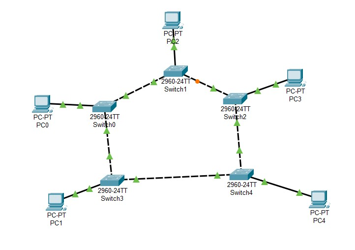
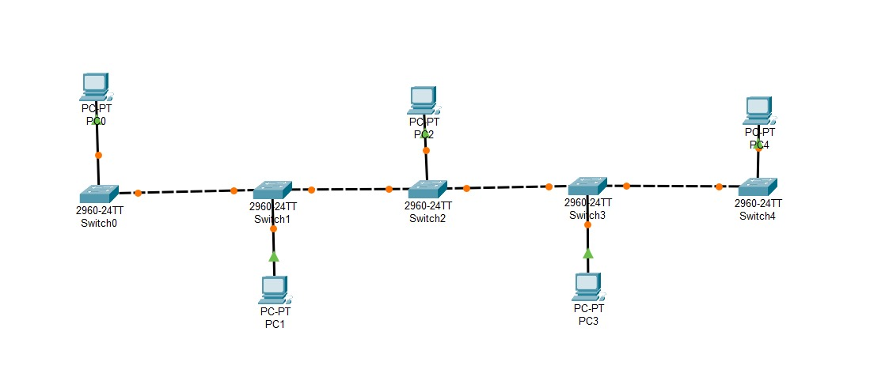
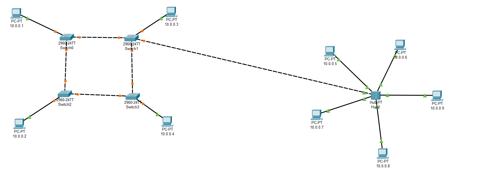

# Network Design with Netcat (nc) Implementation

This document explains the design and implementation of various network topologies using **Netcat** for testing purposes. It covers **Star Topology**, **Bus Topology**, **Hybrid Topology**, **Wired/Wireless LAN**, **Subnetting**, and a **Network Infrastructure Diagram**.


# 1. Prerequisites

- **Netcat (nc)** installed on all participating machines. To install on Linux:
```
sudo apt install netcat
```

# 2. Star Topology


## 2.1. Description
In a Star Topology, each node is connected to a central switch or hub. All communication between devices passes through this central point.

## 2.2. Implementation
For the sake of simplicity, we'll emulate this using nc where one machine acts as the central node, and others act as peripheral devices.

Central Hub/Server: On the central machine (acting as the hub):


```
 nc -l -p 1234
```

Peripheral Nodes: On each client machine, connect to the central hub:

```
nc <central_machine_IP> 1234
```

Each client can now communicate with the central machine, which can forward messages to other clients.

# 3. Bus Topology


## 3.1. Description
In a Bus Topology, all devices share a common communication line (the bus). A signal sent from one machine travels along the bus to all other machines.

## 3.2. Implementation
We will simulate the bus using nc and a virtual bus using broadcast IPs.

Server Node:


```
nc -l -p 1234
```

Client Nodes: Each client will send a broadcast message to simulate communication on a bus.

```
echo "message from client" | nc -u -b 192.168.1.255 1234
```

# 4. Hybrid Topology


## 4.1. Description
A Hybrid Topology combines two or more different types of topologies to form a network.

## 4.2. Implementation
We will combine Star and Bus Topologies. One segment will use Star, and another will use Bus.

Bus Segment: Set up using the bus topology (from Section 3).

Star Segment: Set up the star topology (from Section 2) on another subnet or port.
We now have a hybrid network where both topologies coexist.

# 5. Wired/Wireless LAN

## 5.1. Description
In a LAN, devices are connected either through wired Ethernet cables or wirelessly via Wi-Fi.

## 5.2. Implementation
Wired LAN: For a wired LAN setup, simply ensure that devices are connected via Ethernet cables and assign appropriate IP addresses.

Assign an IP address using:


```
sudo ifconfig eth0 192.168.1.2
```
Wireless topology was implemented through a Python server by connecting to a common Wi-Fi network, with a client, server, and port used for transferring information between devices locally.
 

# 6. Subnetting

## 6.1. Description
Subnetting is the practice of dividing a network into smaller, more manageable sub-networks (subnets).

## 6.2. Example Subnetting Calculation
Given an IP address of 192.168.1.0/24:

Network address: 192.168.1.0

First usable address: 192.168.1.1

Last usable address: 192.168.1.254

Subnet mask: 255.255.255.0

If we want to divide this network into 4 subnets, we can use a /26 prefix:

Subnet 1: 192.168.1.0/26 (usable range: 192.168.1.1 - 192.168.1.62)

Subnet 2: 192.168.1.64/26 (usable range: 192.168.1.65 - 192.168.1.126)

Subnet 3: 192.168.1.128/26 (usable range: 192.168.1.129 - 192.168.1.190)

Subnet 4: 192.168.1.192/26 (usable range: 192.168.1.193 - 192.168.1.254)

## 6.3. Implementation
Assign IP addresses from each subnet to your devices using ifconfig:

`````
sudo ifconfig eth0 192.168.1.1 netmask 255.255.255.192  # First subnet
`````

Test communication between devices within and across subnets using nc.

# 7. Network Infrastructure Diagram

## 7.1. Description
A Network Infrastructure Diagram provides a visual representation of the network layout, showing how devices and topologies are interconnected.

## 7.2. Tools
We have created network design using Cisco Packet Tracer. Here's a rough description of the diagram:

### A central Star Topology segment with 4-5 devices.




### A Bus Topology segment connected to the star through a router.



### A Hybrid Topology segment connecting a start and a bus topology.




Devices connected either via wired Ethernet or wirelessly.


---

This document provides a detailed guide to setting up and testing different network topologies and subnetting using netcat.
